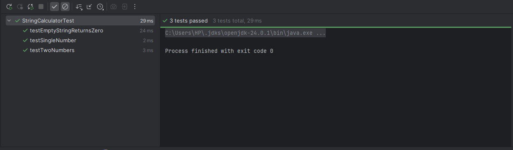
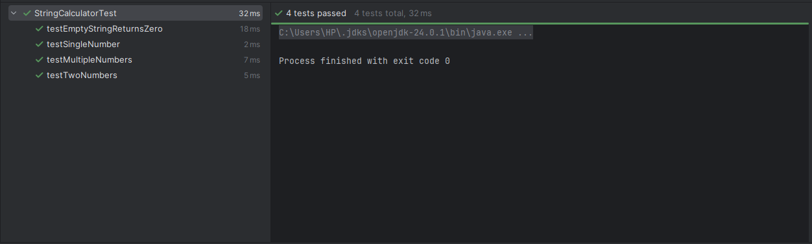
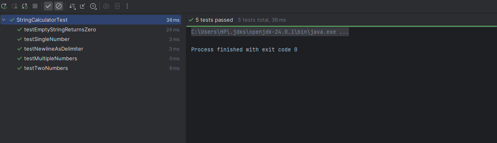
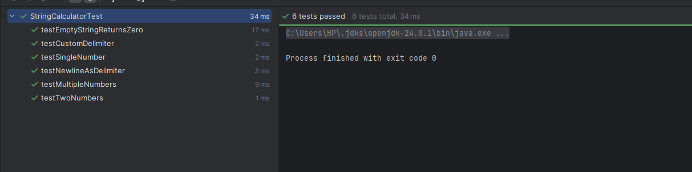
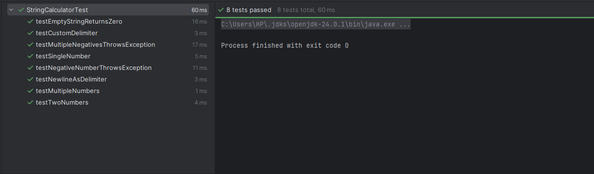
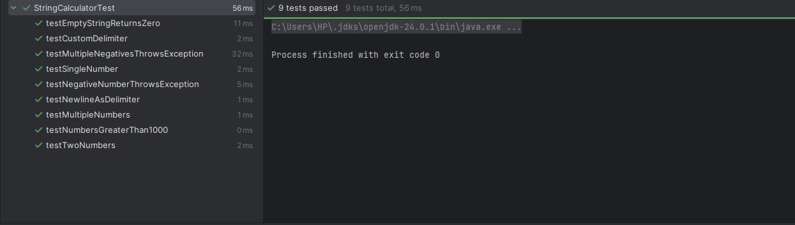
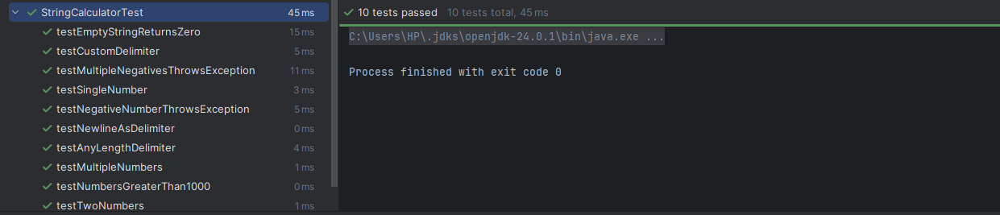
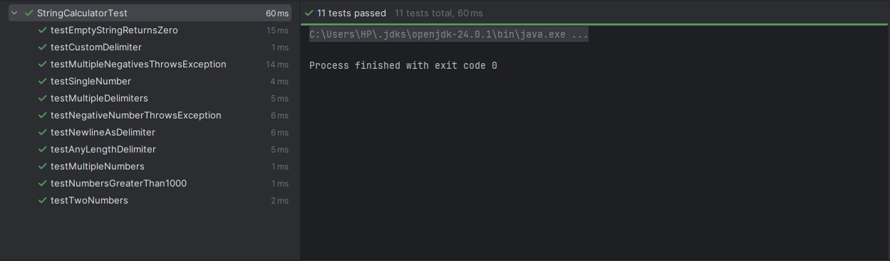

# String Calculator (TDD)

## Step 1

Initial tests and implementation.

---

## Step 2

the Add method to handle an unknown amount of numbers.

---

## Step 3

the Add method to handle new lines between numbers.

---

## Step 4

Support different delimiters in the add method.

---

## Step 5

Throw exception on negative numbers.

---

## Step 6

Numbers greater than 1000 are ignored.

---

## Step 7

Delimiters of any length supported.

---

## Step 8

Support multiple delimiters.

